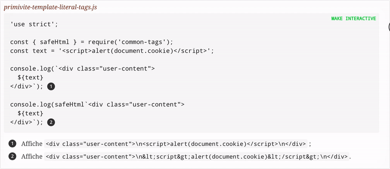

# Asciidoctor Interactive Runner [](https://travis-ci.com/oncletom/asciidoctor-extension-interactive-runner)

> Transform static Asciidoc code listings into **interactive playgrounds** in web browsers. Turn them in microservices too!

Target the code listings with the `%interactive` option and you're almost done!

At the moment, the extension is only compatible with **JavaScript** source code, handled with the [runkit runner][].



# Install

```bash
npm install asciidoctor.js asciidoctor-extension-interactive-runner
```

# Usage

## Turning listings into interactive playgrounds

Add the `%interactive` option to a source element, combined with the `javascript` language syntax.

```adoc
[source%interactive,javascript]
----
const {camelCase} = require('lodash');

console.log(camelCase('get content'));  // <1>
----
<1> Now you can see the output of this line in the browser.
```

## Ephemeral microservices, HTTP(S) servers

The extra option `%endpoint` transforms the interactive code in an ephemeral web service.

```adoc
[source%interactive%endpoint,javascript]
----
const micro = require('micro');
const {random} = require('pokemon');

const server = micro((req, res) => random());

server.listen(4000);
----
```

**Limitation**: you have to name the variable `server` or to make it as the  `module.exports` for this feature to work.

## Specify a Runtime version

You can specify a Node version with the `runner-node` Asciidoc attribute.
Without specifying it, it is assumed it is the Node version converting the Asciidoc document.

```adoc
:runner-node: v16

[source%interactive,javascript]
----
console.log(process.version);
----
```

## Asciidoctor Conversion

```js
const asciidoctor = require('@asciidoctor/core')();
const runnerExtension = require('asciidoctor-extension-interactive-runner');

runnerExtension.register(asciidoctor.Extensions);

asciidoctor.convertFile('path/to/content.adoc', {
  to_file: 'path/to/content.html',
  backend: 'html5',
})
```

# License

[MIT License](LICENSE).

[runkit runner]: https://runkit.com/npm/
